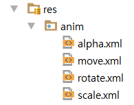

# Animation 구현 방법 두가지

## 1. View Animation
##### 화면에 보이는 View는 움직이나 실제 객체는 원래 자리에 있음, 즉 껍데기만 움직임. 옵션값에 따라 제자리에 돌아올 수도, 옮긴 자리에 놔둘 수도 있음(하지만 여전히 실제 객체는 제자리에 있음)

### 1.1 구현방법 Step 1

##### 그림과 같이 res 폴더에 anim 폴더를 만들고 각 속성에 따라 파일을 만든다. 속성은 이동, 회전, 투명도, 크기 변화 등이 있는데 다음과 같은 태그 이름과 그 속성을 넣어준다. *참고로 xmlns:android="http://schemas.android.com/apk/res/android에는 android에 대한 값이 정의되어 있고 xmlns:tools="http://schemas.android.com/tools"에는 tool에 대한 값이 정의 되어 있다.*

#### 1.1.1 Translate
객체를 직선으로 이동시켜주는 속성
```
<translate xmlns:android="http://schemas.android.com/apk/res/android"
        android:fromXDelta="0"
        android:fromYDelta="0"
        android:toXDelta="100"
        android:toYDelta="-300"
        android:fillAfter="true"
        android:duration="3000">
    </translate>
```
fromXDelta는 첫 X값, toXDelta는 나중의 X값이며 duration은 애니메이션을 얼마나 지속해줄 것인지, fillAfter는 애니메이션이 끝나고 뷰를 끝난 자리에 둘지 말지를 정하는 옵션이다.

#### 1.1.2 Rotate
객체를 회전시켜주는 속성
```
<rotate xmlns:android="http://schemas.android.com/apk/res/android"
        android:fromDegrees="0"
        android:toDegrees="270"
        android:pivotX="50%"
        android:pivotY="50%"
        android:fillAfter="true"
        android:duration="500">
    </rotate>
```
fromDegrees는 첫 각이며 toDegrees는 애니메이션이 끝난 후 각이다. pivotX와 pivotY는 회전의 기준이다.

#### 1.1.3
객체의 투명도를 설정해주는 속성
```
<alpha xmlns:android="http://schemas.android.com/apk/res/android"
       android:fromAlpha="0.0"
       android:toAlpha="1.0"
       android:fillAfter="true"
       android:duration = "3000">
   </alpha>
```
fromAlpha는 첫 투명도, toAlpha는 나중 투명도인데 숫자가 작을 수록 더 투명하다.

#### 1.1.4
객체의 크기를 설정해주는 속성
```
<scale xmlns:android="http://schemas.android.com/apk/res/android"
        android:fromXScale="1.0"
        android:fromYScale="1.0"
        android:toXScale="0.5"
        android:toYScale="5"
        android:fillAfter="true"
        android:duration="3000">
    </scale>
```
fromXScale은 첫 크기, toXScale은 나중 크기이며 1.0은 원래 크기, 숫자가 작으면 줄어들고 숫자가 크면 늘어난다.

### 1.2 구현방법 Step 2
java코드에 Animation 객체를 AnimationUtil 클래스로 만들어주고 loadAnimation 파라미터로 Context와 anim xml을 넘겨준다. 그리고 타겟이 되는 view 객체의 startAnimation(Animation animation) 메서드를 실행시켜주면 된다.
```java
private void move(){
        Animation anim = AnimationUtils.loadAnimation(this, R.anim.move);
        //AnimationUtils는 Animation 객체를 만들어준다.
        btnMove.startAnimation(anim);
    }
```

## 2. Property Animation
##### View Animation과는 달리 껍데기와 알맹이 모두 움직인다. xml 파일이 아닌 java code로 직접 구현한다. 학원에서는 ObjectAnimator 클래스를 이용하였다.

#### 2.1 구현방법 Step 1
##### 1. 대상을 정의하고 2. 애니메이터를 설정하고 3. 애니메이터를 실행한다.
```java
ObjectAnimator aniY= ObjectAnimator.ofFloat(btnJoy, "translationY", 100);
//움직일 대상, 애니메이션 속성, 속성값
```
##### 4. AnimatorSet 클래스로 여러개의 ObjectAnimator를 한번에 작동시킬 수도 있다.
```java
AnimatorSet aniSet = new AnimatorSet();
        aniSet.playTogether(aniY, aniX);
        aniSet.setDuration(3000);
```
##### 5. Interpolator를 통해 속도도 변경할 수 있다.
```java
aniSet.setInterpolator(new LinearInterpolator());
//거리가 가까워지면 속도가 느려지는 것
```
